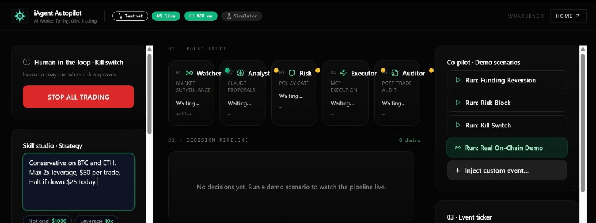
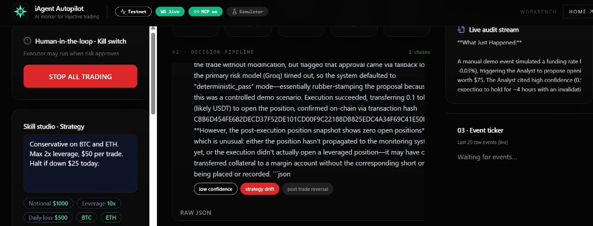

<p align="center">
  
</p>

<h1 align="center">iAgent Autopilot</h1>

<p align="center">
  <strong>Every other Injective AI agent explains the chain or suggests a trade — Autopilot is the one that acts on-chain, within hard limits you set, and proves every decision.</strong><br />
  <em>It trades. You stay in control.</em>
</p>

<p align="center">
  <a href="https://youtu.be/4EFBRQVeDjw"><strong>▶ Watch the 90-second demo</strong></a>
  &nbsp;·&nbsp;
  <a href="https://iagent-autopilot.vercel.app">Live dashboard</a>
  &nbsp;·&nbsp;
  <a href="https://iagent-autopilot.onrender.com/health">Live API</a>
</p>

<p align="center">
  <a href="https://iagent-autopilot.vercel.app">
    
  </a>
  <br />
  <em>Before: operator workbench — strategy set, demo ready, pipeline waiting.</em>
</p>


Built for the **Injective Solo AI Builder Sprint** (May 2026).

---

## What it is

You describe your trading strategy in plain English. Five specialized agents run a governed pipeline — detect events, propose trades, enforce limits, execute on-chain, and audit every outcome. You interact through a dashboard: set strategy, watch the live decision timeline, flip the kill switch, and inspect explorer links for any real transaction.

---

## Why this matters

Most Injective AI submissions **read** the chain — explainers, monitors, copilots — or, at most, **suggest** actions. None of that moves capital. The gap the field leaves open:

- **Explain ≠ execute** — knowing what to do and doing it safely are different problems
- **Single-model agents have no separation of concerns** — analysis and execution share one brain
- **No deterministic guardrails** — one bad prompt can drain an account
- **No audit trail** — you cannot replay why a trade happened

Autopilot closes the loop: **act, within rules, with receipts.**

---

## How AI is used

| Agent | Model | Role |
|---|---|---|
| **Watcher** | Groq Llama 3.3 70B | Polls markets via MCP, detects events, writes human-readable descriptions |
| **Analyst** | Claude Sonnet 4.5 | Reasons over events + strategy + history → structured trade proposals |
| **Risk** | Groq Llama 3.3 70B | Separate-brain sanity check on proposals, layered on **deterministic** limit enforcement |
| **Executor** | *(no LLM)* | Calls Injective MCP write tools only after Risk approval |
| **Auditor** | Claude Sonnet 4.5 | Plain-English explanation of every decision after the fact |

**Anthropic for reasoning, Groq for latency.** Risk runs on a different model than the Analyst — a deliberate two-brain design so the creative proposer never grades its own homework.

Strategy limits can also be parsed from natural language via **Claude Haiku 4.5** in the dashboard (`POST /strategy/parse`).

---

## How Injective is integrated

Autopilot is built on the official **[Injective MCP Server](https://github.com/InjectiveLabs/mcp-server)**. Every chain interaction — balances, positions, opens, closes, and demo proof transfers — flows through MCP tool calls over stdio JSON-RPC. There is no parallel chain SDK in this repo.

The **Executor** is the only component with write access (`trade_open`, `trade_close`, `transfer_send`, etc.). Other agents never receive an MCP client — architectural safety by default.

For a deliberate live testnet proof, enable `DEMO_REAL_TX=true`: the Executor substitutes a bank **`transfer_send`** (USDT) for a perp open, producing an explorer-verifiable tx — e.g. `https://testnet.explorer.injective.network/transaction/{txHash}`.

---

## Trust & safety

| Layer | What it does |
|---|---|
| **Hard limits** | Max notional, leverage, daily loss, allowed markets — enforced deterministically before any LLM sees the proposal |
| **Separate-model risk gate** | Groq Risk vetoes reckless proposals even when they pass numeric limits |
| **Kill switch** | One click halts execution; Watcher and Risk keep running |
| **DRY_RUN by default** | Write tools log intent without broadcasting until you opt in |

**Self-disclosure, not silent failure.** The Auditor receives the full Risk verdict (including internal reason codes) and explains every decision in plain English — including when the system itself misbehaved. In the recorded demo below, the Auditor discloses that the Groq risk model timed out and defaulted to approval, flags `low confidence` / `strategy drift`, and still surfaces the on-chain tx hash — you see the failure mode, not a polished lie.

<p align="center">
  <a href="https://iagent-autopilot.vercel.app">
    
  </a>
  <br />
  <em>After: full pipeline — event → proposal → risk → on-chain execution → Auditor audit with flags.</em>
</p>

---

## See it work

| Step | What happens | What to look for |
|---|---|---|
| 1 | Set strategy in English → **Parse** → **Save** | Structured limits appear instantly |
| 2 | **Run scenario: Funding Reversion** | Full pipeline fires: event → proposal → verdict → execution → audit |
| 3 | **Run scenario: Risk Block** | Analyst proposes an oversized trade → **Risk REJECTS** → Executor never fires |
| 4 | Toggle **Kill switch** | New executions halt; monitoring continues |
| 5 | **Run: Real On-Chain Demo** *(local, opt-in)* | `transfer_send` on testnet → ON-CHAIN badge + [explorer link](https://testnet.explorer.injective.network/) |

The pairing that proves the thesis: **Risk rejects bad judgment** *and* **Executor delivers real on-chain execution** when approved.

**[▶ 90-second walkthrough (YouTube)](https://youtu.be/4EFBRQVeDjw)** · **[Live dashboard](https://iagent-autopilot.vercel.app)**

---

## Quickstart (local)

### Prerequisites

- Python 3.11+ · Node 18+
- [Anthropic](https://console.anthropic.com/) and [Groq](https://console.groq.com/) API keys
- *(Optional)* [Injective MCP Server](https://github.com/InjectiveLabs/mcp-server) — only for live testnet trading; simulator demo works without it

### Run

```bash
git clone https://github.com/demiladepy/iagent-autopilot.git
cd iagent-autopilot

# API
cd runtime
cp .env.example .env
# Add ANTHROPIC_API_KEY, GROQ_API_KEY. Leave SIMULATOR_MODE=true, DRY_RUN=true for local dev.
pip install -r requirements.txt
uvicorn sentinel.main:app --reload --port 8000

# Dashboard (new terminal)
cd dashboard
cp .env.local.example .env.local
# RUNTIME_API_URL=http://127.0.0.1:8000
npm install && npm run dev
```

Open [http://localhost:3000](http://localhost:3000) · API docs [http://localhost:8000/docs](http://localhost:8000/docs)

### Live demo (public deploy)

| Service | URL | Notes |
|---|---|---|
| Dashboard | [iagent-autopilot.vercel.app](https://iagent-autopilot.vercel.app) | Operator UI |
| API | [iagent-autopilot.onrender.com](https://iagent-autopilot.onrender.com) | FastAPI + agents + WebSocket |

The public deploy runs **`SIMULATOR_MODE=true`** and **`DRY_RUN=true`** for judge safety — full agent pipeline, no live capital at risk. See **[DEPLOY.md](DEPLOY.md)** for Render + Vercel env vars (`CORS_ORIGINS`, `SENTINEL_API_KEY`, etc.).

---

## Architecture

```
┌─────────────────────────────────────────────────────────────────────────────┐
│                         Next.js 14 Dashboard (:3000)                        │
│   Strategy · Kill switch · Agent grid · Decision timeline · Demo scenarios  │
│         REST /api/proxy/*  ·  WebSocket ws://runtime:8000/ws                │
└───────────────────────────────────┬─────────────────────────────────────────┘
                                    │
┌───────────────────────────────────▼─────────────────────────────────────────┐
│                    FastAPI Runtime (:8000) · SQLite store                   │
│                         asyncio EventBus (pub/sub)                          │
└───────────────────────────────────┬─────────────────────────────────────────┘
                                    │
     ┌──────────────┐    event     ┌──────────────┐   proposal   ┌──────────┐
     │   Watcher    │─────────────►│   Analyst    │─────────────►│   Risk   │
     │ Groq + MCP   │              │ Claude Sonnet│              │ rules +  │
     │   poll       │              │              │              │ Groq veto│
     └──────────────┘              └──────────────┘              └────┬─────┘
            ▲                                                        │ verdict
            │ sim_inject                                             ▼ approved
     ┌──────────────┐                                         ┌──────────────┐
     │  Simulator   │                                         │   Executor   │──► Injective MCP
     │  (demo)      │                                         │  (no LLM)    │    write tools
     └──────────────┘                                         └──────┬───────┘
                                                                     │ execution
                                                                     ▼
                                                              ┌──────────────┐
                                                              │   Auditor    │
                                                              │ Claude Sonnet│
                                                              │ audit + flags│
                                                              └──────────────┘
```

**Pipeline:** `event` → `proposal` → `verdict` → `execution` → `audit` — each step persisted and streamed live to the dashboard.

---

## Potential for future contributions

Autopilot is **infrastructure**, not a single-purpose app. It is the governed execution layer for the Injective MCP server — the missing safety and audit shell around any agent that can call chain tools.

The same five-agent pipeline extends to all **28 MCP tools** today (staking, bridging, limit orders, transfers, cross-chain flows) without rewriting the runtime. Other builders can fork the agent bus + store + dashboard instead of rolling their own coordination, risk gates, and audit trail.

| Direction | What it unlocks |
|---|---|
| **Tool registry** | Register new MCP tools as agent capabilities with per-tool risk policies |
| **Strategy marketplace** | Publish/import strategy JSON; community strategies run through the same pipeline |
| **Backtesting** | Replay historical events through Watcher → Analyst → Risk without execution |
| **Multi-account** | N strategies × N wallets with isolated limits and shared audit stream |
| **Custom agents** | Drop-in Python modules under `runtime/sentinel/agents/` auto-registered on startup |

Contributions welcome: risk policies, new demo scenarios, MCP tool adapters, dashboard UX. See [PROJECT_AUDIT.md](PROJECT_AUDIT.md) for current status and gaps.

---

## Tech stack

| Layer | Stack |
|---|---|
| Runtime | Python 3.11+, FastAPI, asyncio EventBus, SQLite |
| Agents | Anthropic Claude (Analyst, Auditor, strategy parse) · Groq Llama 3.3 70B (Watcher, Risk) |
| Chain | [Injective MCP Server](https://github.com/InjectiveLabs/mcp-server) via stdio JSON-RPC |
| Dashboard | Next.js 14, Tailwind, WebSocket live stream |
| Deploy | Render (API) · Vercel (dashboard) · optional Docker locally |

---

## Project layout

| Path | Purpose |
|---|---|
| `runtime/sentinel/` | FastAPI app, five agents, SQLite store, MCP client, simulator |
| `dashboard/` | Next.js 14 operator UI |
| `render.yaml` | Render Blueprint for the API |
| `DEPLOY.md` | Render + Vercel deployment guide |
| `docker-compose.yml` | Optional local Docker only |

---

## License

MIT. See [LICENSE](LICENSE) if present, or MIT terms apply to this repository.

---

## Built by

**[@demiladepy](https://github.com/demiladepy)** — Injective Solo AI Builder Sprint, May 2026.

Tagging: [@injective](https://x.com/injective) · [@NinjaLabsHQ](https://x.com/NinjaLabsHQ) · [@NinjaLabsCN](https://x.com/NinjaLabsCN)

---

## Submission checklist — fill before you submit

- [x] **Demo video** — [youtu.be/4EFBRQVeDjw](https://youtu.be/4EFBRQVeDjw)
- [x] **Live dashboard** — [iagent-autopilot.vercel.app](https://iagent-autopilot.vercel.app)
- [x] **Live API** — [iagent-autopilot.onrender.com](https://iagent-autopilot.onrender.com)
- [x] **GitHub repo** — [github.com/demiladepy/iagent-autopilot](https://github.com/demiladepy/iagent-autopilot)
- [x] **Screenshots** — `docs/assets/dashboard-overview.png` (before) · `docs/assets/dashboard-decision-card.png` (after)
- [x] **Render CORS** — `CORS_ORIGINS=https://iagent-autopilot.vercel.app` (if using API key auth)
